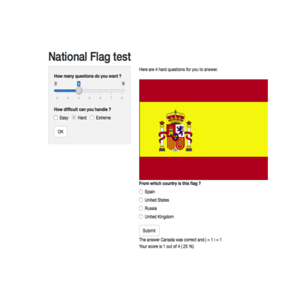

FlagQuiz
========================================================
author: Paul van der Kooy
date: 8 October 2016
autosize: true

Introduction
========================================================


This presentation documents an R and Shiny application to test your knowledge of national flags around the world.  


Assignment for the Building Data Products module of the Data Sciences Specialisation

Objectives
========================================================

The application includes the following:

- Some form of input (widget: textbox, radio button, checkbox, ...)
- Some operation on the ui input in sever.R
- Some reactive output displayed as a result of server calculations
- Enough documentation so that a novice user could use your application.
- Publish on Shiny website itself
- Read and use data from open/public source

Data source
========================================================

This application make use of the open country data information from http://www.geonames.org/. It utilizes the country index and the flag repository.
Example:


```r
library(png)
library(RCurl)
country <- "US"
url <- paste0("http://www.geonames.org/flags/m/",tolower(as.character(country)),".png")
img <- readPNG(getURLContent(url))
plot.new()
rasterImage(img,0,0,0.5,0.27)
```


Application Manual
========================================================

The application is straight forwards and self-explanatory. The user is asked to enter a number of questions he or she likes to answer and a level of difficulty. After confirmation the application presents a number of national flags, which the users has to identify by means of multiple choice questions.

Finally, the score is maintained and presented back to the user.



Issues & Regrets
========================================================

Due to time constraints not all functionality intended has been included.
- The reactivity of the application is not flawless and can be improved
- Collecting statistics from all users and present individual score against the score distribution of the population was not yet realised
- The application was intended to also include Hints
